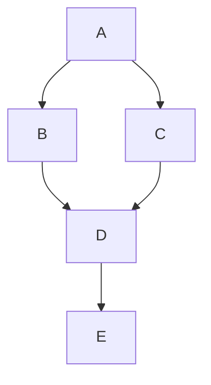
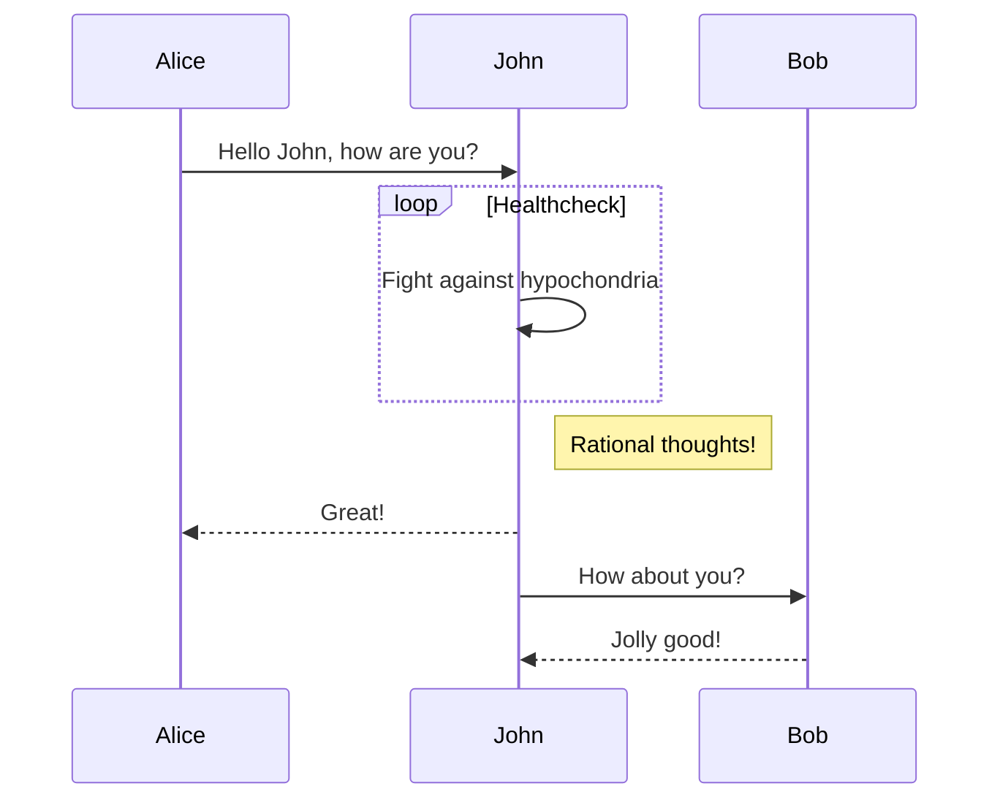
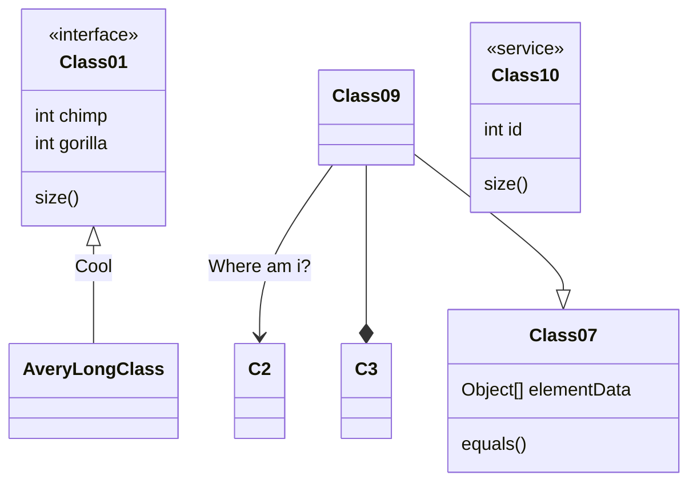
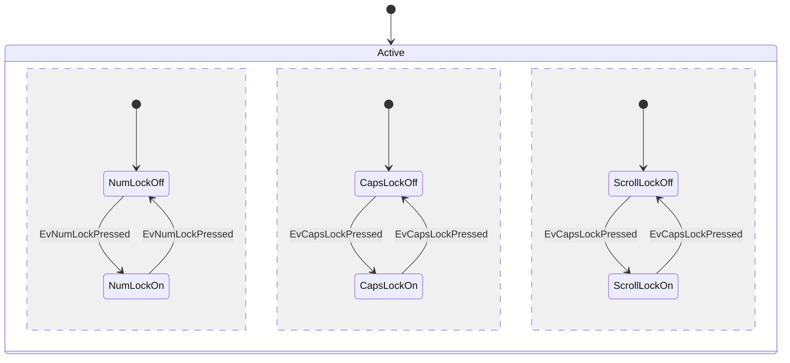
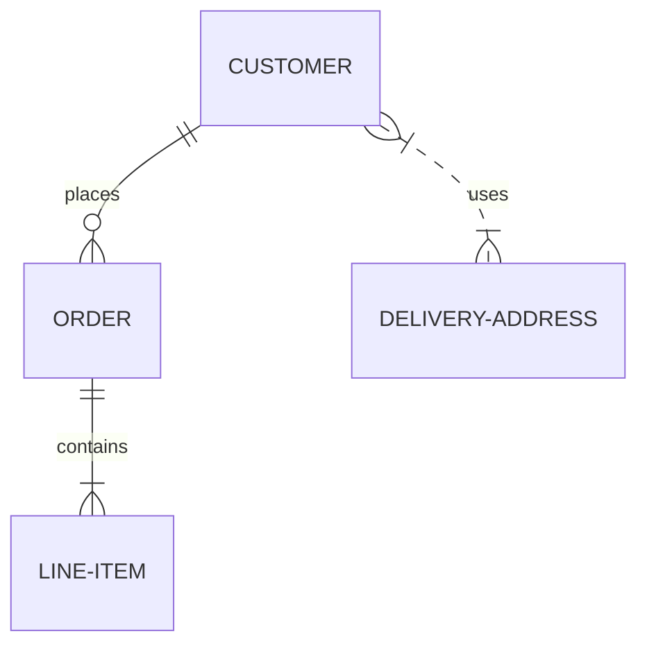
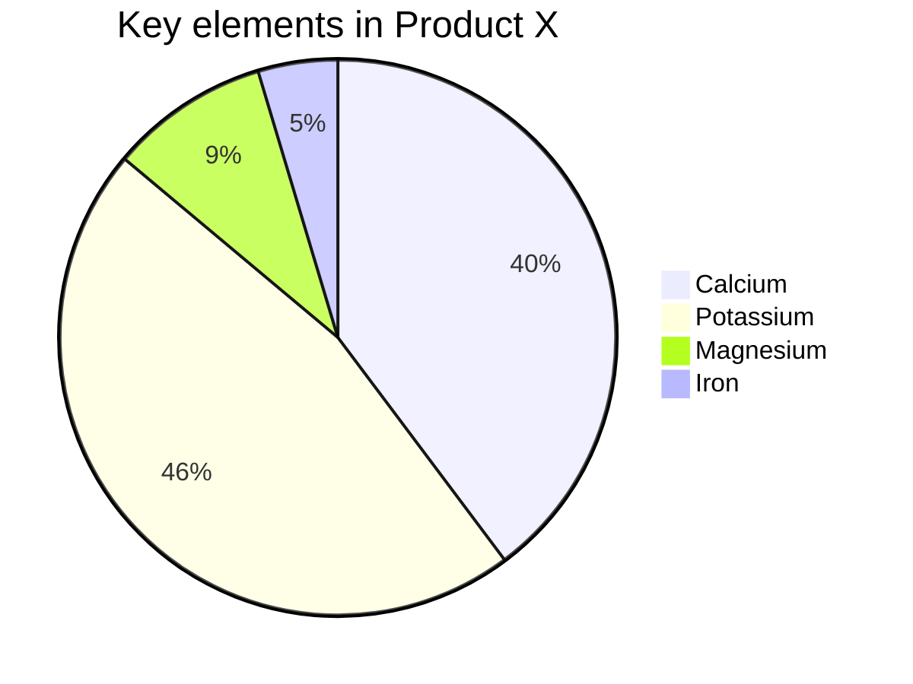
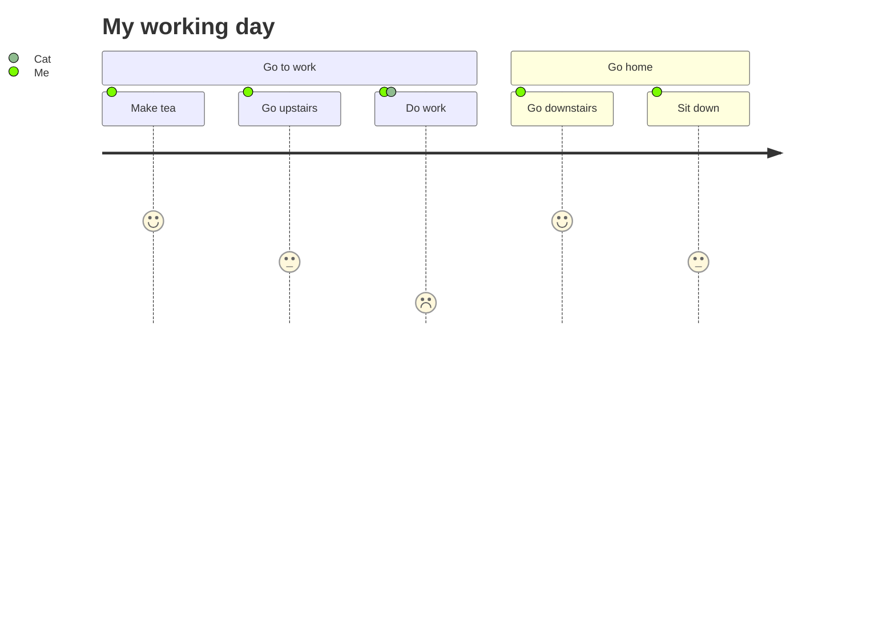
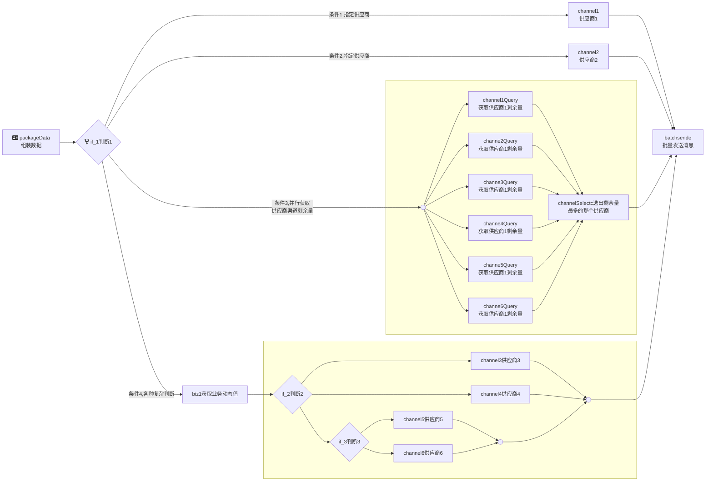

# 发展

::: tip 说明
对知识的回顾可能能更好的运用
:::


::: timeline 1945
- 
  - 二战结束
  - 雅尔塔体制确立
- 
:::

::: timeline 1947

- 冷战开始
- 杜鲁门主义

:::
::: timeline 1949
- 北约组织建立
:::
::: timeline 1955
- 两级格局形成
- 华约组织建立
:::


<audio/>

## 音视频
<iframe frameborder="no" border="0" marginwidth="0" marginheight="0" width=330 height=86 src="//music.163.com/outchain/player?type=2&id=1488737309&auto=1&height=66"></iframe> 


视频：

<Video
    src="/lol.mp4"
    :width="666.67"
    :height="375"
    :second="45" />


<iframe src="//player.bilibili.com/player.html?aid=1402082162&bvid=BV19r42187nk&cid=1479266252&p=1" scrolling="no" border="0" 
width="500" height="400"
frameborder="no" framespacing="0" allowfullscreen="true"> </iframe>


## 绘制流程图
绘图教程：https://zhuanlan.zhihu.com/p/139166407#Mermaid%20%E7%BB%98%E5%9B%BE
流程图

时序图


甘特图
```mermaid
graph TB

id1(圆角矩形)--普通线-->id2[矩形];
subgraph 子图
id2==粗线==>id3{菱形}
id3-. 虚线.->id4>右向旗帜
id3--无箭头---id5((圆形))
end
```


类图

状态图

实体关系图

饼图

旅程图







